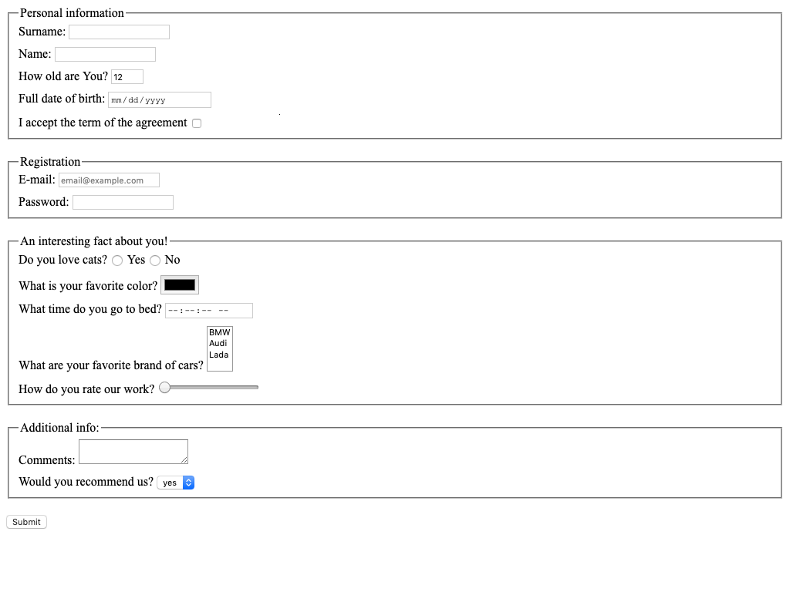

# HTML form
Replace `<your_account>` with your Github username and copy the links to Pull Request description:
- [DEMO LINK](https://titech0.github.io/layout_html-form/)
- [TEST REPORT LINK](https://titech0.github.io/layout_html-form/report/html_report/)

> Follow [this instructions](https://mate-academy.github.io/layout_task-guideline/#how-to-solve-the-layout-tasks-on-github)
___

## ❗️❗️❗️ Check your code with the [CHECKLIST](https://github.com/mate-academy/layout_html-form/blob/master/checklist.md) before ❗️❗️❗️

## The task:
Create HTML page with form. On form submit send form data to `https://mate-academy-form-lesson.herokuapp.com/create-application`

## Notes
- Every field should have name attribute
- Every field should have label, which focuses input on label click
- Do not use tabs for indentation. Instead use 2 spaces
- Most of the time you want each tag in new line
- Form should have different inputs with such types:
  - [+] text :34
  - [+] number :54
  - [+] email :95
  - [+] checkbox :76
  - [+] radio :123
  - [+] password :105
  - [+] range :174
  - [+] time :152
  - [+] color:142
  - [+] date :66
- Form should have textarea and select elements.
- You should use each of this attribute at least once
  - [+] required :required
  - [+] min :57
  - [+] max :57
  - [+] minlength :107
  - [+] maxlength :107
  - [+] multiple :196
- Age should be at least `1` and at max `100` with a default value of `12`
- The email field should have placeholder value: `email@example.com`.
- Text fields should have `autocomplete="off"`.
- `Submit` button should have a `type="submit"`
- Vertical distance between inputs should be `10px`
- Vertical distance between groups should be `20px`
- Any other styles should be browser default

--> Don't forget to proofread your code using [CHECKLIST](https://github.com/mate-academy/layout_html-form/blob/master/checklist.md)

## Tips & Hints
1. You can group fields with [fieldset](https://developer.mozilla.org/en-US/docs/Web/HTML/Element/fieldset) tag
2. The form should have correct `method` and `action`
3. Follow the [code style guide](https://mate-academy.github.io/style-guides/htmlcss.html)
